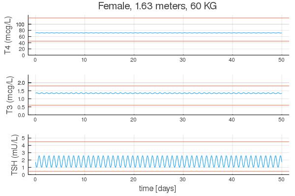
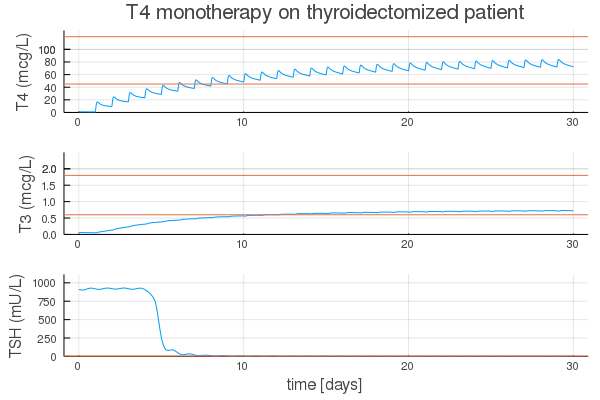
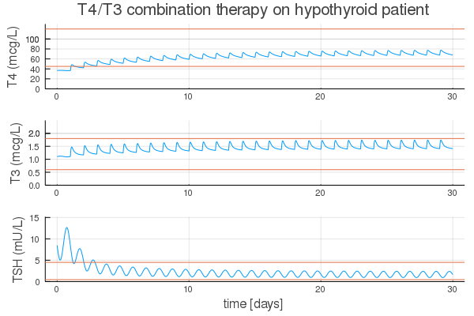
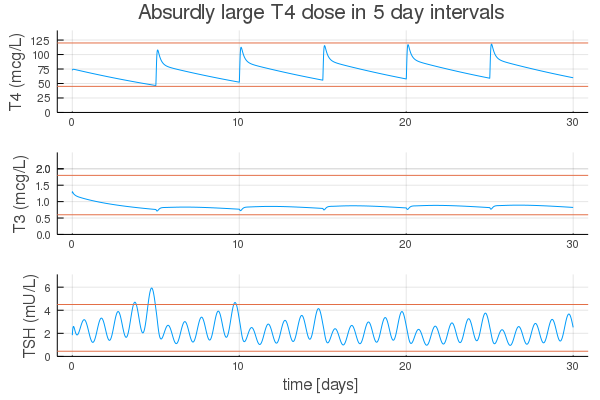

# Thyrosim

`Thyrosim.jl` is an updated version of [THYROSIM](http://biocyb1.cs.ucla.edu/thyrosim/cgi-bin/Thyrosim.cgi). It heavily relies on the amazing [DifferentialEquations.jl](https://github.com/SciML/DifferentialEquations.jl) package to solve systems of ODEs. 

This tool is developed to

1. Better optimize replacement LT4 and LT4+LT3 dosing for treating hypothyroid patients, based on their individual hormone levels, heights, weights and gender
2. Aid in understanding more precisely how gender and BMI impact thyroid hormone transient and steady state dynamical regulation over time in these patients.

## Installation

Download and install [Julia](https://julialang.org/downloads/). This package supports Julia `v1.6`+ for Mac, Linux, and window machines. Within Julia, copy and paste the following:
```julia
using Pkg
pkg"add https://github.com/biona001/Thyrosim.jl"
```
For running the examples below, the following packages are also necessary
```julia
pkg"add Plots"
```

## Examples

Load packages
```julia
using Thyrosim, Plots
```
In plots below, orange lines indicate normal range. 

### Healthy patient simulation
```julia
sex = false # true = male, false = female
h = 1.63    # unit = meters
w = 60      # unit = KG
sol = simulate(h, w, sex) # solve ODE
plt = output_plot(sol, title="Female, $h meters, $w KG") # make plot
```


### T4 monotherapy
```julia
sex = false    # true = male, false = female
h = 1.63       # unit = meters
w = 90         # unit = KG
T4dose = 120.0 # unit = mcg
dial = [0.0; 0.88; 0.0; 0.88] # no T4 secretion, normal T4 excretion, no T3 secretion, normal T3 excretion
sol = simulate(h, w, sex, dial=dial, T4dose=T4dose) # solve ODE
plt = output_plot(sol, title="T4 monotherapy on thyroidectomized patient") # make plot
```


### T4/T3 combination therapy
```julia
sex = false    # true = male, false = female
h = 1.63       # unit = meters
w = 45         # unit = KG
T4dose = 75.0  # unit = mcg
T3dose = 5.0   # unit = mcg
RTF = 0.10     # 10% residual thyroid function
dial = [RTF; 0.88; RTF; 0.88] # T4 secretion, normal T4 excretion, T3 secretion, normal T3 excretion
sol = simulate(h, w, sex, dial=dial, T4dose=T4dose, T3dose=T3dose) # solve ODE
plt = output_plot(sol, title="T4/T3 combination therapy on hypothyroid patient") # make plot
```


### Absurdly large T4 dose in 5 day intervals
```julia
sex = true      # true = male, false = female
h = 1.78        # unit = meters
w = 70          # unit = KG
T4dose = 600    # unit = mcg
interval = 24*5 # unit = hours
dial = [0.0; 0.88; 0.0; 0.88] # no T4 secretion, normal T4 excretion, no T3 secretion, normal T3 excretion
sol = simulate(h, w, sex, dial=dial, warmup=false, T4dose=T4dose, dosing_interval=interval) # solve ODE
plt = output_plot(sol, title="Absurdly large T4 dose in 5 day intervals")  # make plot
```


## Citation and Reproducibility

If you use `Thyrosim.jl` for academic purposes, please cite the following paper
+ [Optimized Replacement T4 and T4+T3 Dosing in Male and Female Hypothyroid Patients With Different BMIs Using a Personalized Mechanistic Model of Thyroid Hormone Regulation Dynamics](https://www.frontiersin.org/articles/10.3389/fendo.2022.888429/full?&utm_source=Email_to_authors_&utm_medium=Email&utm_content=T1_11.5e1_author&utm_campaign=Email_publication&field=&journalName=Frontiers_in_Endocrinology&id=888429)

## Bug reports 

If you encounter a bug or need user support, please open a new issue on Github. Please provide as much detail as possible for bug reports, ideally a sequence of reproducible code that lead to the error.

PRs and feature requests are welcomed!
